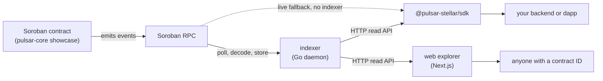

# Pulsar App

[](https://github.com/pulsar-stellar/pulsar-app/actions/workflows/ci-go.yml)
[](https://github.com/pulsar-stellar/pulsar-app/actions/workflows/ci-ts.yml)
[](https://github.com/pulsar-stellar/pulsar-app/actions/workflows/ci-web.yml)
[](https://www.npmjs.com/package/@pulsar-stellar/sdk)
[](LICENSE)

Pulsar Stellar is a developer toolkit for Soroban contract events. Every Stellar
project that needs to consume its contract's events today writes the same
plumbing from scratch: XDR decoders, indexer glue, custom APIs. Pulsar Stellar
provides three shared building blocks so they don't have to. A Rust library that
turns raw contract events into typed data, a Go daemon that stores historical
events past the seven-day RPC retention window, and a web explorer where anyone
can paste a contract ID and browse every event that contract has ever emitted,
decoded and searchable. It serves Soroban dapp builders, backend engineers
integrating with existing protocols, and auditors reviewing contract behavior
post-deployment.

`pulsar-app` is the application layer of that toolkit. The Rust contract layer
lives in [`pulsar-stellar/pulsar-core`](https://github.com/pulsar-stellar/pulsar-core).

## Where this repository sits

The toolkit is three repositories. A contract emits events; `pulsar-core`
provides the reference contract and the Rust decoder; `pulsar-app` (this repo)
indexes, serves, and displays those events; `pulsar-docs` documents the whole.



Everything a user of the toolkit actually touches lives here: a client library
they install, a daemon they run or call, and a site they can send a colleague to.

## What this repository holds

Three sub-stacks share this repository and ship on their own timelines:

- **`packages/sdk`**: the TypeScript client, published as `@pulsar-stellar/sdk`.
  It queries the indexer HTTP API, and reads live events straight from Soroban
  RPC when no indexer is available.
- **`indexer/`**: the Go daemon. It polls Soroban RPC, decodes each event, and
  stores it past the seven-day RPC retention window. It also serves the read API
  the SDK and the explorer are built against. See
  [`indexer/README.md`](indexer/README.md).
- **`apps/web`**: the Next.js explorer. Paste a contract ID, browse its decoded
  event history. Not landed yet, see Status.

Documentation is maintained in the separate `pulsar-stellar/pulsar-docs`
repository and publishes through GitBook.

## Monorepo map

```
pulsar-app/
├── package.json              workspace root
├── pnpm-workspace.yaml       members: packages/*, apps/*
├── tsconfig.base.json        strict config every TS workspace extends
├── .agent/                   long-term project memory, including the ADR log
├── .github/workflows/        one CI workflow per sub-stack
├── scripts/                  repo-wide checks CI runs
├── packages/
│   └── sdk/                  TypeScript SDK, Vitest, tsup dual build
├── indexer/                  Go daemon, separate go.mod
│   ├── cmd/pulsar-indexer/   binary entry point
│   ├── internal/             api, apierror, config, db, decoder, logger,
│   │                         models, rpc, store, validate, version
│   └── migrations/           per-engine SQL, one directory each
└── apps/                     not yet present, arrives with the explorer
```

Workspace members land in sequence as the build progresses, so a fresh clone
holds fewer directories than the finished layout. The status table below records
what exists at this commit.

`indexer/` is not a pnpm workspace member. The language boundary is a natural
seam and the two toolchains stay independent, recorded in ADR-002.

`migrations/` carries a directory per engine rather than one shared set. SQLite
accepts several Postgres declarations and then behaves differently, so a single
file would apply cleanly on both and silently corrupt one. See ADR-029.

## Status

Sprint 6 complete, deployment next. The SDK is released. The indexer runs as a
daemon, stores events, and serves its full HTTP API (REST and GraphQL) alongside
the poller, with the write routes gated by authentication and rate limiting. The
web explorer is built and runs locally. Nothing is deployed yet.

| Artifact | State |
|---|---|
| Workspace scaffold | complete |
| `@pulsar-stellar/sdk` | released, `0.1.0` on npm, tag `v0.1.0-app` |
| Go indexer, ingestion | running: polls RPC, decodes, stores events |
| Go indexer, REST API | served: health, contracts, and events routes |
| Go indexer, GraphQL API | served: read-only `POST /graphql` (ADR-043) |
| Go indexer, write gate | live: bearer auth plus rate limiting on writes (ADR-044) |
| Postgres schema | verified: migrations applied to a real Postgres, in CI |
| Web explorer | built: lookup, contract detail, event list, event detail |
| Deployment | not started: no image, no hosted instance (ADR-047 decides the shape) |

The daemon loads its configuration, opens the database, applies migrations,
registers the bootstrap contracts, runs one polling loop per contract, and serves
the HTTP surface, all stopping cleanly on SIGINT or SIGTERM. The read routes
(`GET /health`, the `/contracts` collection, `GET /contracts/{id}/events`,
`GET /events/{id}`, and `POST /graphql`) are public; the state-changing routes
(`POST` and `DELETE /contracts`) require a bearer token and sit behind a rate
limiter. A `DELETE` cascades to every event under the contract, which is why the
write gate is a precondition of exposing the surface. Full detail, including every
environment variable and the SQLite versus Postgres split, is in
[`indexer/README.md`](indexer/README.md).

The web explorer lives in [`apps/web`](apps/web). It reads the indexer over
GraphQL through one validated boundary that reuses the SDK's Zod schemas but
never its XDR decoder, so `@stellar/stellar-sdk` stays out of the browser bundle
(ADR-046). Four screens are in place: a contract lookup, a contract detail page
that fetches the contract and its first page of events in one nested query, an
event list whose filters, ordering, and cursor pagination all live in the URL, and
an event detail page that renders the decoded value taxonomy as a collapsible tree
with a JSON export. Run it locally with `pnpm --filter ./apps/web dev`; see
[`apps/web/README.md`](apps/web/README.md). There is no hosted instance yet.

This repository depends on `pulsar-core` `v0.1.0-contracts`, deployed to Stellar
testnet. Its showcase contract ID is the fixture every sub-stack here reads from,
recorded in `.env.example`.

## Roadmap

The full roadmap lives in [`docs/roadmap-product.md`](docs/roadmap-product.md).
The application layer ships across five sprints, joined to `pulsar-core` at
product-level milestones.

| Sprint | Scope | State |
|---|---|---|
| 4 | Monorepo scaffold and TypeScript SDK | done, `@pulsar-stellar/sdk@0.1.0` |
| 5 | Go indexer: ingestion, REST, GraphQL, write gate | in progress, Phase F closing |
| 6 | Next.js explorer | next |
| 7 | GitBook documentation | planned |
| 8 | Deploy, publish, `v0.1.0-app` product milestone | planned |

Beyond v0.1: webhooks and SSE for push delivery instead of polling, cross-contract
search, and historical replay from archive nodes past the RPC retention window.
Each is deferred by choice with a trigger recorded in the roadmap, not dropped.

## Related resources

- npm package: [`@pulsar-stellar/sdk`](https://www.npmjs.com/package/@pulsar-stellar/sdk)
- Release tag: [`v0.1.0-app`](https://github.com/pulsar-stellar/pulsar-app/releases/tag/v0.1.0-app)
- Rust contract layer: [`pulsar-stellar/pulsar-core`](https://github.com/pulsar-stellar/pulsar-core)
- Indexer detail: [`indexer/README.md`](indexer/README.md)
- Decision log (ADRs): [`.agent/decisions.md`](.agent/decisions.md)

## Using the SDK

```sh
pnpm add @pulsar-stellar/sdk
```

It reads from a running indexer, and falls back to live Soroban RPC when there
is none. See [`packages/sdk/README.md`](packages/sdk/README.md) for the client
surface and worked examples.

## Prerequisites

| Tool | Version |
|---|---|
| Node.js | 22 LTS, pinned in `.nvmrc`, see ADR-012 |
| pnpm | 11 or newer |
| Go | 1.23 or newer, for the indexer only |

`indexer/go.mod` pins the Go 1.26.7 toolchain. A distribution Go from 1.23 acts
as a bootstrap and downloads that toolchain on first build, so an older
distribution Go needs no manual upgrade. See ADR-030.

## Local development

```sh
nvm use                        # picks up .nvmrc
corepack enable                # provides pnpm
pnpm install                   # installs every TS workspace
cp .env.example .env.local
```

TypeScript workspaces, from the repository root:

```sh
pnpm lint
pnpm typecheck
pnpm test
pnpm build
```

The Go indexer, from `indexer/`:

```sh
go vet ./...
go test -race ./...
go build ./...
```

Repo-wide checks, which CI also runs:

```sh
./scripts/verify-env-parity.sh        # every env var in code is in .env.example
./scripts/verify-env-parity.test.sh   # and that check itself still catches drift
```

`.env.example` copies to a working local configuration as it stands, defaulting
to SQLite so the indexer needs no database to set up. Set
`PULSAR_INDEXER_ADMIN_TOKEN` before the daemon will start, since the write surface
must not come up without one. `.env.local` is never committed. Production values
are set in the Vercel and Render dashboards.

## Contributing

`CONTRIBUTING.md` carries the full standard: setup, commit rules, test
discipline, and the code rules per sub-stack. The workflow in effect:

1. **Open an issue first.** Substantive work is tracked by a GitHub issue that
   states the scope, the acceptance criteria, and the ADR or specification
   section that governs it. The PR closes it with `Closes #NN`.
2. **Branch from `main`, one logical unit per branch.** Name it for the unit,
   for example `step-68-events-handlers`. Do not push to `main` directly.
3. **Commit with discipline.** One commit per logical unit, a conventional
   `type(scope): description` subject, and a body that says what changed and
   why. Stage exact paths, never `git add .`.
4. **Push the branch and open a PR.** The description says what changed and how
   it was verified. It is detailed, not a one-line summary.
5. **CI must be green before review.** Three workflows gate a PR: `ci-ts.yml`,
   `ci-go.yml`, and `ci-web.yml`. A PR that changes behavior without changing
   tests is sent back.
6. **A second maintainer reviews and merges.** The author does not merge their
   own PR.

Small or urgent corrections may go to `main` directly at a maintainer's
discretion. Changes to the indexer's HTTP surface, its database layer, or its
migrations carry a higher review bar, because that surface is publicly reachable
and writes data every downstream consumer reads.

Report a security issue privately per `SECURITY.md`, not in a public issue.

## License

Apache-2.0. See [LICENSE](LICENSE).

